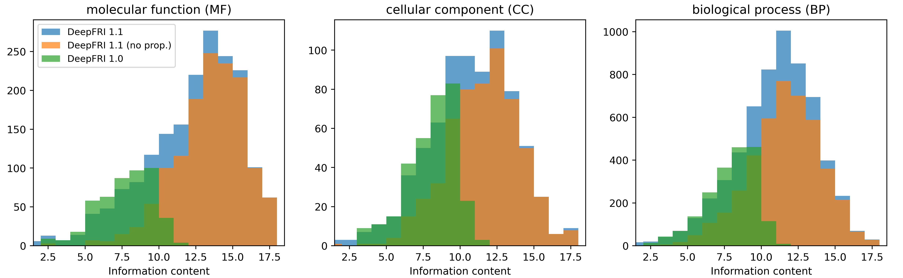

# DeepFRI v1.1

Deep functional residue identification. 

This repository contains release v1.1 that includes original deepFRI LSTM-GCN architecture but retrained on [AlphaFold models](https://alphafold.ebi.ac.uk/) with [Gene Ontology Uniprot](https://www.ebi.ac.uk/GOA/) annotations. Note that CNN model hasn't been retrained. 

The upgrade allows for much greater coverage of GO-terms as compared to deepFRI v1.0 but requires protein structures as input. Therefore, if you need similar performance but on protein sequence data, you may wish to consider usage of [Metagenomic-DeepFRI](https://github.com/bioinf-mcb/Metagenomic-DeepFRI) with deepFRI v1.1 pre-trained models for prediction. 

In contrary to original deepFRI (v1.0), the 1.1 release hasn't been trained to predict Enzyme Commission (EC) numbers.

<p>
    
    <em>deepFRI LSTM-GCN architecture</em>
</p>

<p>
    
    <em>Number of predicted GO-terms in a given information content range for deepFRI v1.0, v.1.1 and v1.1. without GO-term propagation</em>
</p>

## Citing
```
@article {Gligorijevic2019,
	author = {Gligorijevic, Vladimir and Renfrew, P. Douglas and Kosciolek, Tomasz and Leman,
	Julia Koehler and Cho, Kyunghyun and Vatanen, Tommi and Berenberg, Daniel
	and Taylor, Bryn and Fisk, Ian M. and Xavier, Ramnik J. and Knight, Rob and Bonneau, Richard},
	title = {Structure-Based Function Prediction using Graph Convolutional Networks},
	year = {2019},
	doi = {10.1101/786236},
	publisher = {Cold Spring Harbor Laboratory},
	URL = {https://www.biorxiv.org/content/early/2019/10/04/786236},
	journal = {bioRxiv}
}

```
## Installation

The easiest way to install deepFRI is to use Conda:

```
conda create -n deepfri_env --file requirements.txt 
```
Please check out the `requirements.txt` and comment out unnecessary packages (see details in the file).

#  <a name="cpu"></a> Protein function prediction with CPU

For quick predictions (with up to a few % drop in accuracy) you can run deepFRI v1.1 on CPU using `predict_fast.py` with the following options:

1. `--input`  or `-i`, str, path to PDB file
2. `--input_file`  or `-f`, str, path to folder with PDB files
3. `--seq` or `-s`, str, input sequence 
4. `--fasta_fn` , str, path to fasta file with input sequences
5. `--output_folder` or `-o`, str, path to output folder (each prediction is saved to a separate output file as `PDBNAME_MODELNAME.csv`)
6. `--verbose` or `v`, whether to print prediction on the screen
7. `--models` or `-m`, str, models to use (`mf` - Molecular Function, `bp` - Biological Process, `cc` - Cellular Component)
8. `--propagate` or `-p`, whether to propagate output predictions using GO graph

**NOTE 1:** options 1., 2., 3., 4. are mutually exclusive.  
**NOTE 2**: if a sequence is provided as input, ESMFold API is used to predict structure.

# Protein function prediction with GPU

deepFRI v1.1 has been trained on a GPU and the resulted models requires GPU for inference. If you don't have GPU please go to [CPU](#cpu) section.

To predict protein functions use `predict.py` script with the following options:

* `seq`             str, Protein sequence as a string
* `cmap`            str, Name of a file storing a protein contact map and sequence in `*.npz` file format (with the following numpy array variables: `C_alpha`, `seqres`. See `examples/pdb_cmaps/`)
* `pdb`             str, Name of a PDB file (cleaned)
* `pdb_dir`         str, Directory with cleaned PDB files (see `examples/pdb_files/`)
* `cmap_csv`        str, Filename of the catalogue (in `*.csv` file format) containg mapping between protein names and directory with `*.npz` files (see `examples/catalogue_pdb_chains.csv`)
* `fasta_fn`        str, Fasta filename (see `examples/pdb_chains.fasta`)
* `model_config`    str, JSON file with model filenames (see `trained_models/`)
* `ont`             str, Ontology (`mf` - Molecular Function, `bp` - Biological Process, `cc` - Cellular Component)
* `output_fn_prefix`   str, Output filename (sampe prefix for predictions/saliency will be used)
* `verbose`         bool, Whether or not to print function prediction results
* `saliency`        bool, Whether or not to compute class activaton maps (outputs a `*.json` file)

Generated files (see `examples/outputs/`):
* `output_fn_prefix_MF_predictions.csv`   Predictions in the `*.csv` file format with columns: Protein, GO-term/EC-number, Score, GO-term/EC-number name
* `output_fn_prefix_MF_pred_scores.json`   Predictions in the `*.json` file with keys: `pdb_chains`, `Y_hat`, `goterms`, `gonames`
* `output_fn_prefix_MF_saliency_maps.json` JSON file storing a dictionary of saliency maps for each predicted function of every protein

deepFRI offers 6 possible options for predicting functions. See examples below.

## Option 1: predicting functions of a protein from its contact map

Example: predicting MF-GO terms for Parvalbumin alpha protein using its sequence and contact map (PDB: [1S3P](https://www.rcsb.org/structure/1S3P)):

```
>> python predict.py --cmap ./examples/pdb_cmaps/1S3P-A.npz -ont mf --verbose

```

### Output:

```txt
Protein GO-term/EC-number Score GO-term/EC-number name
query_prot GO:0005509 0.99824 calcium ion binding
```

## Option 2: predicting functions of a protein from its sequence

Example: predicting MF-GO terms for Parvalbumin alpha protein using its sequence (PDB: [1S3P](https://www.rcsb.org/structure/1S3P)):

```
>> python predict.py --seq 'SMTDLLSAEDIKKAIGAFTAADSFDHKKFFQMVGLKKKSADDVKKVFHILDKDKDGFIDEDELGSILKGFSSDARDLSAKETKTLMAAGDKDGDGKIGVEEFSTLVAES' -ont mf --verbose

```

### Output:

```txt
Protein GO-term/EC-number Score GO-term/EC-number name
query_prot GO:0005509 0.99769 calcium ion binding
```

## Option 3: predicting functions of proteins from a fasta file

```
>> python predict.py --fasta_fn examples/pdb_chains.fasta -ont mf -v

```

### Output:

```txt
Protein GO-term/EC-number Score GO-term/EC-number name
1S3P-A GO:0005509 0.99769 calcium ion binding
2J9H-A GO:0004364 0.46937 glutathione transferase activity
2J9H-A GO:0016765 0.19910 transferase activity, transferring alkyl or aryl
(other than methyl) groups
2J9H-A GO:0097367 0.10537 carbohydrate derivative binding
2PE5-B GO:0003677 0.53502 DNA binding
2W83-E GO:0032550 0.99260 purine ribonucleoside binding
2W83-E GO:0001883 0.99242 purine nucleoside binding
2W83-E GO:0005525 0.99231 GTP binding
2W83-E GO:0019001 0.99222 guanyl nucleotide binding
2W83-E GO:0032561 0.99194 guanyl ribonucleotide binding
2W83-E GO:0032549 0.99149 ribonucleoside binding
2W83-E GO:0001882 0.99135 nucleoside binding
2W83-E GO:0017076 0.98687 purine nucleotide binding
2W83-E GO:0032555 0.98641 purine ribonucleotide binding
2W83-E GO:0035639 0.98611 purine ribonucleoside triphosphate binding
2W83-E GO:0032553 0.98573 ribonucleotide binding
2W83-E GO:0097367 0.98168 carbohydrate derivative binding
2W83-E GO:0003924 0.52355 GTPase activity
2W83-E GO:0016817 0.36863 hydrolase activity, acting on acid anhydrides
2W83-E GO:0016818 0.36683 hydrolase activity, acting on acid anhydrides, in phosphorus-containing anhydrides
2W83-E GO:0017111 0.35465 nucleoside-triphosphatase activity
2W83-E GO:0016462 0.35303 pyrophosphatase activity
```

## Option 4: predicting functions of proteins from contact map catalogue

```
>> python predict.py --cmap_csv examples/catalogue_pdb_chains.csv -ont mf -v
```

### Output:

```txt
Protein GO-term/EC-number Score GO-term/EC-number name
1S3P-A GO:0005509 0.99824 calcium ion binding
2J9H-A GO:0004364 0.84826 glutathione transferase activity
2J9H-A GO:0016765 0.82014 transferase activity, transferring alkyl or aryl
(other than methyl) groups
2PE5-B GO:0003677 0.89086 DNA binding
2PE5-B GO:0017111 0.12892 nucleoside-triphosphatase activity
2PE5-B GO:0004386 0.12847 helicase activity
2PE5-B GO:0032553 0.12091 ribonucleotide binding
2PE5-B GO:0097367 0.11961 carbohydrate derivative binding
2PE5-B GO:0016887 0.11331 ATPase activity
2W83-E GO:0097367 0.97069 carbohydrate derivative binding
2W83-E GO:0019001 0.96842 guanyl nucleotide binding
2W83-E GO:0017076 0.96737 purine nucleotide binding
2W83-E GO:0001882 0.96473 nucleoside binding
2W83-E GO:0035639 0.96439 purine ribonucleoside triphosphate binding
2W83-E GO:0032555 0.96294 purine ribonucleotide binding
2W83-E GO:0016818 0.96181 hydrolase activity, acting on acid anhydrides, in phosphorus-containing anhydrides
2W83-E GO:0032550 0.96142 purine ribonucleoside binding
2W83-E GO:0016817 0.96082 hydrolase activity, acting on acid anhydrides
2W83-E GO:0016462 0.95998 pyrophosphatase activity
2W83-E GO:0032553 0.95935 ribonucleotide binding
2W83-E GO:0032561 0.95930 guanyl ribonucleotide binding
2W83-E GO:0032549 0.95877 ribonucleoside binding
2W83-E GO:0003924 0.95453 GTPase activity
2W83-E GO:0001883 0.95271 purine nucleoside binding
2W83-E GO:0005525 0.94635 GTP binding
2W83-E GO:0017111 0.93942 nucleoside-triphosphatase activity
2W83-E GO:0044877 0.64519 protein-containing complex binding
2W83-E GO:0001664 0.31413 G protein-coupled receptor binding
2W83-E GO:0005102 0.20078 signaling receptor binding
```

## Option 5: predicting functions of a protein from a PDB file
```
>> python predict.py -pdb ./examples/pdb_files/1S3P-A.pdb -ont mf -v

```

### Output:

```txt
Protein GO-term/EC-number Score GO-term/EC-number name
query_prot GO:0005509 0.99824 calcium ion binding
```

## Option 6: predicting functions of a protein from a directory with PDB files
```
>> python predict.py --pdb_dir ./examples/pdb_files -ont mf --saliency --use_backprop

```

### Output:

See files in: `examples/outputs/`

# Data

Data (train and validation) used for training deepFRI v1.1 model are provided as TensorFlow-specific `TFRecord` and require a few TB of disk space. If you wish to get access to that files, please write to: <p.szczerbiak@sanoscience.org>.

# Pretrained models

Pretrained models can be downloaded from:
* [GPU models](https://ujchmura-my.sharepoint.com/:u:/g/personal/pawel_szczerbiak_uj_edu_pl/EQapH9FwjsdPrQNLejNhvUkBPUE0CAV-jrioj-NlNFSB8g?e=kKwjxV) (use these models if you run deepFRI v1.1 on GPU with `predict.py`)
* [CPU Models](https://ujchmura-my.sharepoint.com/:u:/g/personal/pawel_szczerbiak_uj_edu_pl/ESSNbXW5HM9OnFunXcZMxBkB5uDMAF-D8Vx958PDNnl_5A?e=69FDQp) (use these models if you run deepFRI v1.1 on CPU with `predict_fast.py`)

Uncompress `tar.gz` file into the deepFRI directory (`tar xvzf trained_models.tar.gz -C /path/to/DeepFRI`).
